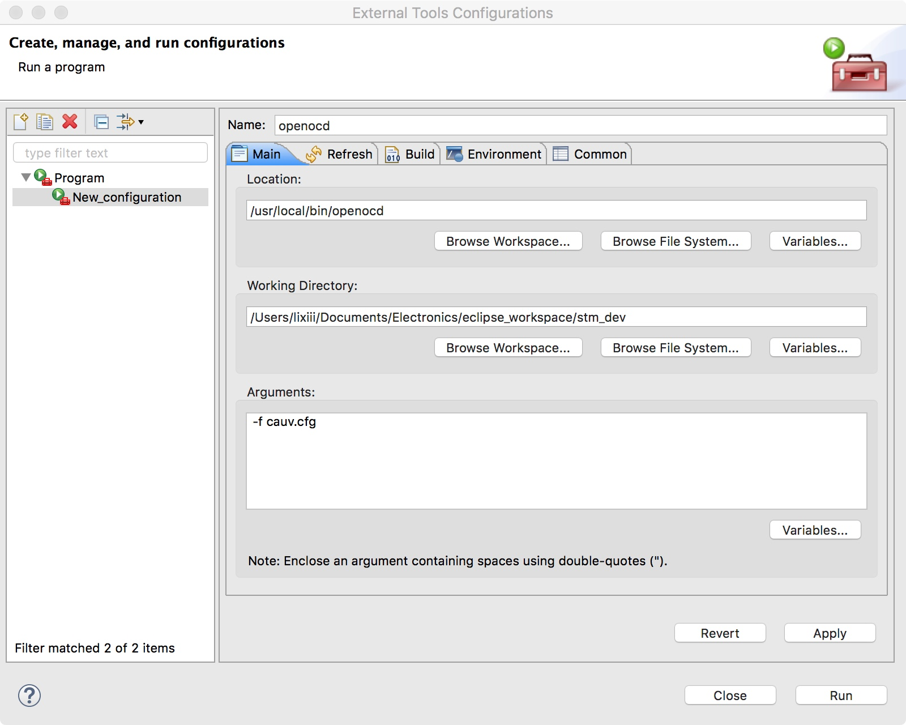
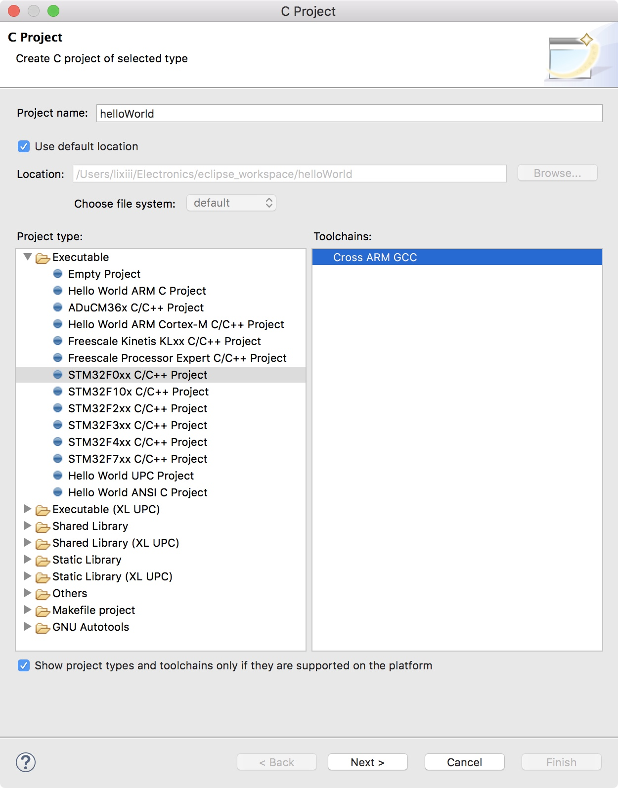
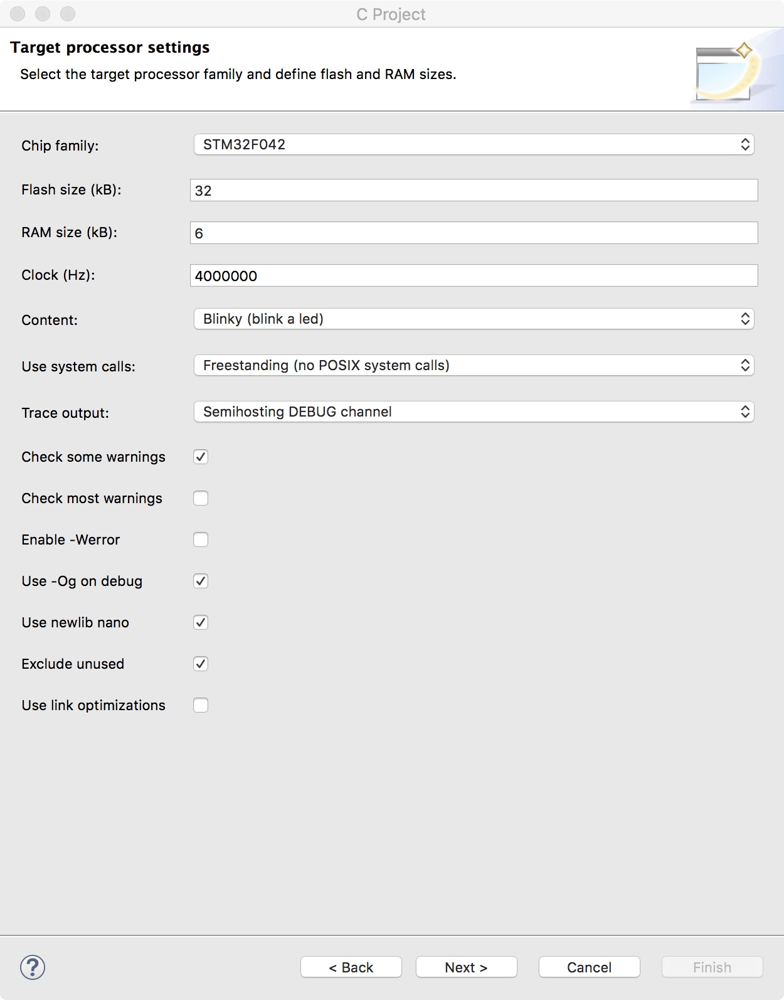
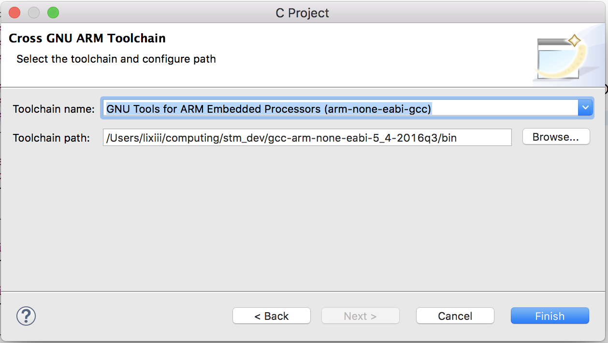
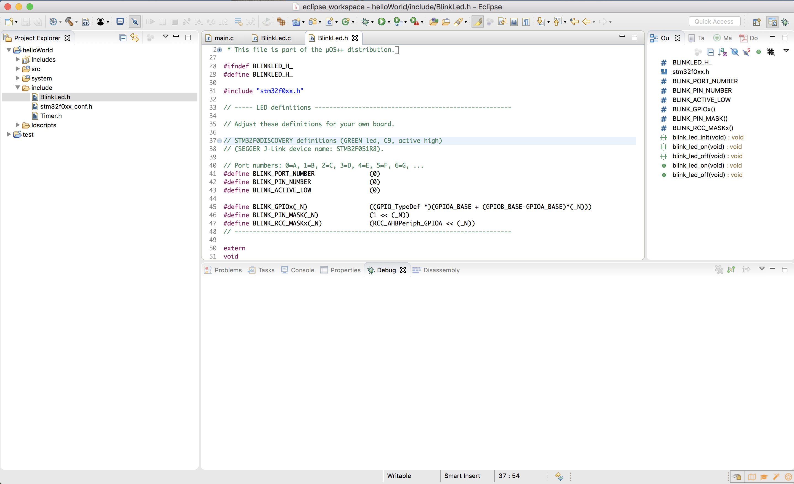
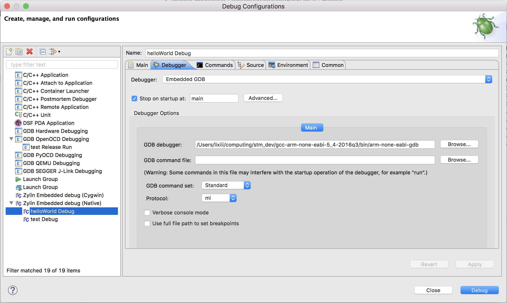
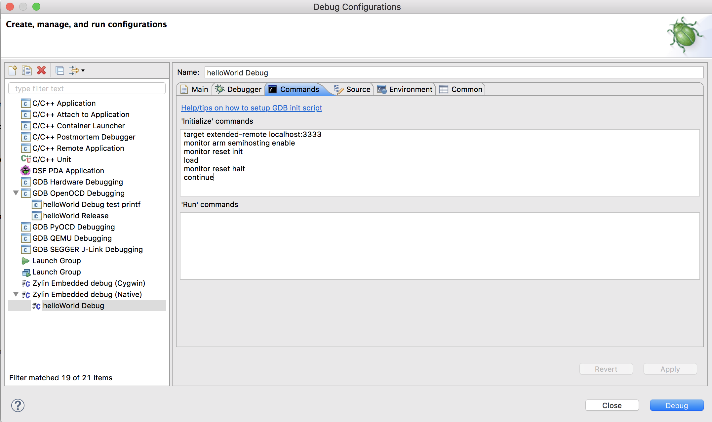
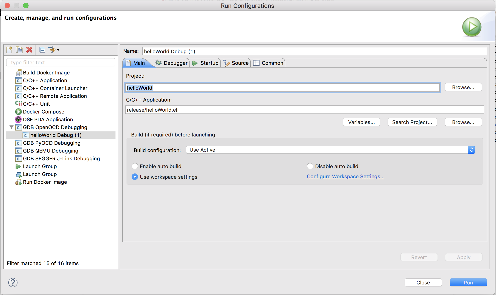

CAUV Electronics tutorial

Author: Li Xi (xl404)

# 1. Contents

<!-- TOC -->

- [1. Contents](#1-contents)
- [2. Printed Circuit Boards (PCBs)](#2-printed-circuit-boards-pcbs)
  - [2.1. Overview](#21-overview)
  - [2.2. The Basics](#22-the-basics)
  - [2.3. Great KiCad Tutorials](#23-great-kicad-tutorials)
- [3. Programming STM microprocessors](#3-programming-stm-microprocessors)
  - [3.1. Table of software and packages required](#31-table-of-software-and-packages-required)
  - [3.2. Installing the IDEs and required packages on a Mac](#32-installing-the-ides-and-required-packages-on-a-mac)
    - [3.2.1. Eclipse IDE and required packages in Eclipse](#321-eclipse-ide-and-required-packages-in-eclipse)
    - [3.2.2. Installing the GCC ARM toolchain](#322-installing-the-gcc-arm-toolchain)
    - [3.2.3. Installing and Configuring OpenOCD](#323-installing-and-configuring-openocd)
    - [3.2.4. Creating and configuring the helloWorld project](#324-creating-and-configuring-the-helloworld-project)
    - [3.2.5. Creating a Debug Configuration](#325-creating-a-debug-configuration)
    - [3.2.6. Creating a Release Run Configuration](#326-creating-a-release-run-configuration)
  - [3.3. References](#33-references)
  - [3.4. Useful Links](#34-useful-links)

<!-- /TOC -->

# 2. Printed Circuit Boards (PCBs)

## 2.1. Overview 

This repository serves as a guide to get you started with CAUV electronics. In this series of tutorials, you will first learn how to design useful real-life circuits with ICs (Integrated Circuits) and sensors. You will also learn how to use KiCad to design circuit schematics, PCBs(Printed Circuit Boards) and generate Gerbers for manufacturing the PCBs. This series will also provide guidance on how to navigate through the sometimes incomprehensible datasheets of the components that you will be using. 

If you are an absolute beginner in electronics, ie. you only know fundamental theories like Ohm's law, then you can read the following [The Basics](#the-basics) section. Otherwise, feel free to skip to the next section on [KiCad](#kicad). However, you can, by all means, still read The Basics section to refresh your memory of the very basics of circuit design. 

In this tutorial, you will build a prototype of a pressure sensor board from scratch. This board is used for testing purposes,  but is actually ready to be installed into the actual vehicle. This board contains a pressure sensor, as the name implies, a micro-controller and a differential signal converter. More technical details are given further into this tutorial.  The final design is available at the `cauv-electronics/pressure_sensor` folder in the https://github.com/CambridgeAUV/cauv_electronics repository. It is also available in this repository, together with the KiCad project at each of the steps below. 


## 2.2. The Basics

Micro-controllers are used in circuits to communicate with sensors and other circuit components, such as other micro-controllers. Micro-controllers need to be programmed in order to function. Micro-controllers come in different packages. The most commonly used are surface mount packages which include closely packed pins and small package sizes. *Pins* on IC packages serve as connections between the silicon wafer within the package and the outside world, ie. other circuit components. All circuit componenets have a certain number of pins that must be connected to some other circuit components. Common ones include *power pins*, *GPIO pins* (General Purpose Input Ouput, which basically means the micro-controller can programmatically control the state of this pin), *reset pins*, etc. Even simple components like resistors have pins. 

During the circuit design process, you will need to first design (or in most cases, look for them on the internet) *schematic symbols* for the components that you are using. *Schematic symbols* are schematic representations of the components on a 2D sheet of paper. While most of the time you will be able to find the *schematic symbols* of the componenets that you are using, it is **important** that you know how to create a new one entirely from scratch as from time to time, you will be working with legacy or niche components, especially since at CAUV, we might be using very niche parts. It is recomended that you try to create a simple and common component from scratch so that you can compare your result with the standard symbol. In the following section, you will find very helpful tutorials on how to do so. 

After you have all the *schematic symbols*, or most of them as you can create them along the way, you will need to draw the *schematic* of the circuit. After that, you will need to look for *footprints* of each of the components that you have used. *Component footprints* are the drawings of how your component will look like and how it will be soldered onto the PCB. They should include things like *pins*, labels, component names, and etc. Again, it is vital that you know how to create a *footprint* from scratch and this is even more important as you will definitely come across components that have weird *foorprints* which cannot be found online. This is even more important than understanding how to draw *schematic symbols* because poorly drawn *footprints* will make it impossible to assemble your circuit because it is guaranteed that your component will not fit into the poorly drawn footprint. Again, the following section will direct you to good articles teaching how to learn it well. 

Finally, after you have the *footprints*, you will need to associate each of the footprints with the components that you have used and import them onto the PCB. After that, you will need to properly arrange the components (represented as their footprints) and *route* the connections. PCB *routing* should be done by hand as the auto-router will sometimes create problems, especially when the circuit is very sensitive to interferance and signal distortion. 

If you need to send the PCB to manufacturers, you will need to generate *gerber files*, which are basically instructions to tell manufacturers how to manufacture your PCB. 

The link https://hackaday.com/2016/09/21/creating-a-pcb-in-everything-introduction/ has more details on the basics of PCB design and you should read it if you have the time. 


**The following sections in this chapter are incomplete as of Nov 2017**

## 2.3. Great KiCad Tutorials 

* http://docs.kicad-pcb.org/stable/en/getting_started_in_kicad.pdf
* https://hackaday.com/2016/11/17/creating-a-pcb-in-everything-kicad-part-1/
* https://hackaday.com/2016/12/09/creating-a-pcb-in-everything-kicad-part-2/
* https://hackaday.com/2016/12/23/creating-a-pcb-in-everything-kicad-part-3/


# 3. Programming STM microprocessors

While the following section is intended for a Mac user, all of the packages are available for Linux and Windows as well. 

## 3.1. Table of software and packages required

As of November 2017, the following software and packages are installed: 

| Name of the software / package | Version | Link to download (if available) |
| -------- | ------ | ---------- |
| openOCD | 0.10.0 | [download](http://openocd.org)|
| Eclipse IDE |  Oxygen.1a Release (4.7.1a) | [download](http://www.eclipse.org/downloads/) | 
| GNU ARM Embedded Toolchain | 5-2016-q3-update | [download](https://launchpad.net/gcc-arm-embedded/+download)|
| Zylin Embedded CDT | 4.18.1 | Download from Eclipse IDE |
| Eclipse CDT | Multiple | [Download](http://www.eclipse.org/downloads/download.php?file=/tools/cdt/releases/8.8.1/cdt-8.8.1.zip) here and install in Eclipse |
| GNU ARM plugin | Multiple | Download from Eclipse IDE |


## 3.2. Installing the IDEs and required packages on a Mac

Most of the instructions here are taken from [here](http://www.davidrojas.co.uk/stm32f3discovery-on-mac-os-x-using-eclipse-gcc-arm-and-openocd/). In fact, this section serves as an updated version of the excellent post by *davidrojas*. 

### 3.2.1. Eclipse IDE and required packages in Eclipse

Above all, grab a copy of the latest Eclipse at the link given above. Once downloaded and installed, launch it and go to *Help > Install New Software*. 

First of all, we will install the **GNU ARM plugin** for Eclipse. Click on the *Add...* button next to the top dropdown, to add a new repository. Insert the location http://gnuarmeclipse.sourceforge.net/updates and click OK. The component “CDT GNU Cross Development Tools” will appear below. Select everything and install it.

Next, repeat the process to install the **Zylin Embedded CDT plugin**, necessary to debug and flash. Add the repository with the location http://opensource.zylin.com/zylincdt and install the component “Zylin Embedded CDT”. 

Finally, we will install the **Eclipse CDT**. The instructions were given by *curtishx* on [element14](https://www.element14.com/community/thread/55206/l/cannot-install-j-link-debugging-on-fresh-eclipse-on-windows-10?displayFullThread=true). To install the aforementioned Eclipse CDT:

- Download the CDT package [Eclipse downloads - Select a mirror](http://www.eclipse.org/downloads/download.php?file=/tools/cdt/releases/8.8.1/cdt-8.8.1.zip)  **NOTE this is different from the CDT downloaded from Eclipse itself**
- Open up Eclipse: 
- Go to Help-> Install New Software
- Click on Add-> Archive, and then selected the "cdt-8.8.1.zip" folder in my downloads directory, and hit OK.
- Select all of the "CDT Main Features"
- Select all of "CDT Option Features"
- Install the selected features


### 3.2.2. Installing the GCC ARM toolchain

Next grab a copy of the toolchain. 

Excellent explanantion from *davidrojas*:

`The first thing you need is a toolchain. The GCC ARM is maintained by ARM employees, and is the best open source compiler you can find. It includes the debugger GDB. Download the mac installation tarball of the 4.7 series release and uncompress it in your home folder, no installation needed.`

NOTE: You have to remember where you have placed this folder. I suggest, as mentioned below again, creating a dedicated `cauv/stm_dev` folder somewhere you can easily locate. 

### 3.2.3. Installing and Configuring OpenOCD

  Again, quoting the excellent explanation from *davidrojas*:

  `OpenOCD is an open on-chip debugger and progamming tool. It will communicate with gdb to debug and flash the board by using the stlinkv2 debugger. The easiest way to install it is using Homebrew, a pacakage manager for OS X similar to MacPorts or Fink. If you don’t use Homebrew already, follow the one-step installation instructions on its website. After that, open a Terminal and paste the following line:`

  ``` brew install openocd --enable_ft2232_libftdi --enable_stlink ```

  Once installed, you need a `cauv.cfg` file in a directory of your choice, but **DO REMEMBER** where you put this. You will need this many many *many* times. I suggest creating a dedicated `cauv/stm_dev/` folder. Once you have that, just copy the following code into a file called `cauv.cfg`. This file can also be found in this repository as a standalone file. 


  ```
    # cauv.cfg
    # © COPYRIGHT CAMBRIDGE AUTONOMOUS UNDERWATER VEHICLE NOVEMBER 2017
    # Author: Li Xi (xl404)

    source [find interface/stlink-v2.cfg]
    transport select hla_swd
    source [find target/stm32f0x.cfg]
    reset_config srst_only srst_nogate
  ```

  To be able to run OpenOCD inside Eclipse, you have to add it clicking in the menu *Run > External Tools > External Tools Configuration…*. Create a new item clicking in the *New launch configuration* icon and fill in the location, working directory and arguments as in the following image and click *Apply*. The working directory will be where you created the `cauv.cfg` file.

  

  Now comes the moment of truth. Connect the CAUV USB module to your computer via a debugger (either an STM discoery board or the ST-LINK v2 debugger) using the SWD interface (Check out the datasheet pinouts to figure out how to connect the jumper wires correctly). Once connected, hit *Run* and if you see something like this, then congrats openOCD works:

  ```
  Info : Unable to match requested speed 1000 kHz, using 950 kHz
  Info : Unable to match requested speed 1000 kHz, using 950 kHz
  Info : clock speed 950 kHz
  Info : STLINK v2 JTAG v27 API v2 SWIM v0 VID 0x0483 PID 0x3748
  Info : using stlink api v2
  Info : Target voltage: 2.891005
  Info : stm32f0x.cpu: hardware has 4 breakpoints, 2 watchpoints
  ```

  Every time you start Eclipse, you will need to start *OpenOCD with Run > External Tools > OpenOCD*. When you exit Eclipse, it will kill the OpenOCD daemon. If for some reason it is still running, paste in a Terminal the command `killall openocd`. If you fancy command line interface over GUI for some reason (like me), you can run the openOCD without configuring Eclipse at all by first getting into the directory where you created the `cauv.cfg` file and running the command `openocd -f ./cauv.cfg` to launch openOCD. **NOTE that it is vital that your OpenOCD can run properly before proceeding as it *IS the only way* by which your computer communicates with the STM chip**. If you get it running, congratulations! You have gotten the most difficult task under your control!

### 3.2.4. Creating and configuring the helloWorld project

  To create a new project, click *File > New > C Project* and select *STM32F0xx C/C++ Project -> Cross ARM GCC* as shown in the image below:

  

  Then click next and enter the details **exactly** as shown. This **must** be entered correctly for the device that you are working on or else mysterious memory error will occur. 

  

  Then click *Next* several times, leaving the default options, until you reach the last step, where you select the toolchain name and path, as you can see in the image. You will have to browse for the path of the `bin` folder where you installed the *GCC ARM Toolchain*. See the example below to have a rough idea. 

  

  Finally, click *finish* to create the project. Go to `/include/BlinkLed.h`to change the port and pin numbers to correspond to the LED on the CAUV PCB. Change both `BLINK_PORT_NUMBER` and `BLINK_PIN_NUMBER` to `0` as shown below. 
  
  

  Next, save the file and build the project by clicking *Project -> Build Project* and the build process should proceed smoothly without error. Now that the project is built, the only thing left is the add a *Debug Configuration*. 

### 3.2.5. Creating a Debug Configuration

  Click on *Run > Debug Configurations…* and double-click on *Zylin Embedded debug (Native)*. On the *“Debugger”* tab, click on the *GDB debugger field* and browse to select the gdb executable of the *GCC ARM toolchain*. It will be something like `PATH_TO_GCC/bin/arm-none-eabi-gdb`. 

  

  Finally, go to the *“Commands”* tab and paste this in the *‘Initialize’* commands box:

  ```
  target extended-remote localhost:3333
  monitor reset init
  load
  monitor reset halt
  ```

  
  
  And now you are all good to go. Before getting too excited, click *Apply* and *Debug*. The debugging session will start, Eclipse will switch to the Debug perspective and the program will be downloaded to flash. Then, when you click on the *Resume (F8)* icon, the program will start executing, stopping at main. Clicking again on *Resume* will continue the execution. If everything is configured correctly, you will see the LED flashing on your board. You can pause/stop the execution, set breakpoints and watch variables and registers. 

  Congratulations! You are now all set up to properly programme the STM32 on CAUV PCB. Happy coding!
  
### 3.2.6. Creating a Release Run Configuration

  The debug configuration is useful for debugging but it will not work if the circuit is not connected to a debugger. If you need the programme to run on startup and to run without connecting to a debugger, you need a Release Run Configuration. 

  First of all, build the project Release Configuration by setting the active build configuration. Click on *Project > Build Configurations > Set Active* and select *2 Release*. Then build the project. You should now see a `Release` folder in your project. Check that there is a file named `helloWorld.elf`, or - if your project has a different name - `yourProjectName.elf`. Remember the name of this file. 

  Click on *Run > Run Configurations…* and double-click *GDB OpenOCD Debugging*. The following window will appear and enter the correct path under *C/C++ Application*. This is the path to the binary that is built using the Release Configuration above. In my case, it is `Release/helloWorld.elf` as shown in the figure below.

   

  Finally, click *Run* and the debugger will flash the binary file onto the chip. 

  PS: In fact, the binary file is the `.hex` file in the `Release` folder. When you Run the above Run Configuration, the `.hex` file is the file that is flashed into the chip. If you want to share the binary for some reason, you should share the `.hex` file. This file can be manually flashed into the chip via many different methods. For instance, this can be done with `openocd`. 


## 3.3. References 

  - Follow instructions on http://www.davidrojas.co.uk/stm32f3discovery-on-mac-os-x-using-eclipse-gcc-arm-and-openocd/ **except** on the installation of CDT pakages at step `Eclipse IDE`
  - To install CDT packages, follow instruction on https://www.element14.com/community/thread/55206/l/cannot-install-j-link-debugging-on-fresh-eclipse-on-windows-10?displayFullThread=true

## 3.4. Useful Links

  - [Datasheet of the STM device we are using (STM32F042F6P6 package TSSOP-20)](http://www.st.com/content/ccc/resource/technical/document/datasheet/52/ad/d0/80/e6/be/40/ad/DM00105814.pdf/files/DM00105814.pdf/jcr:content/translations/en.DM00105814.pdf)
